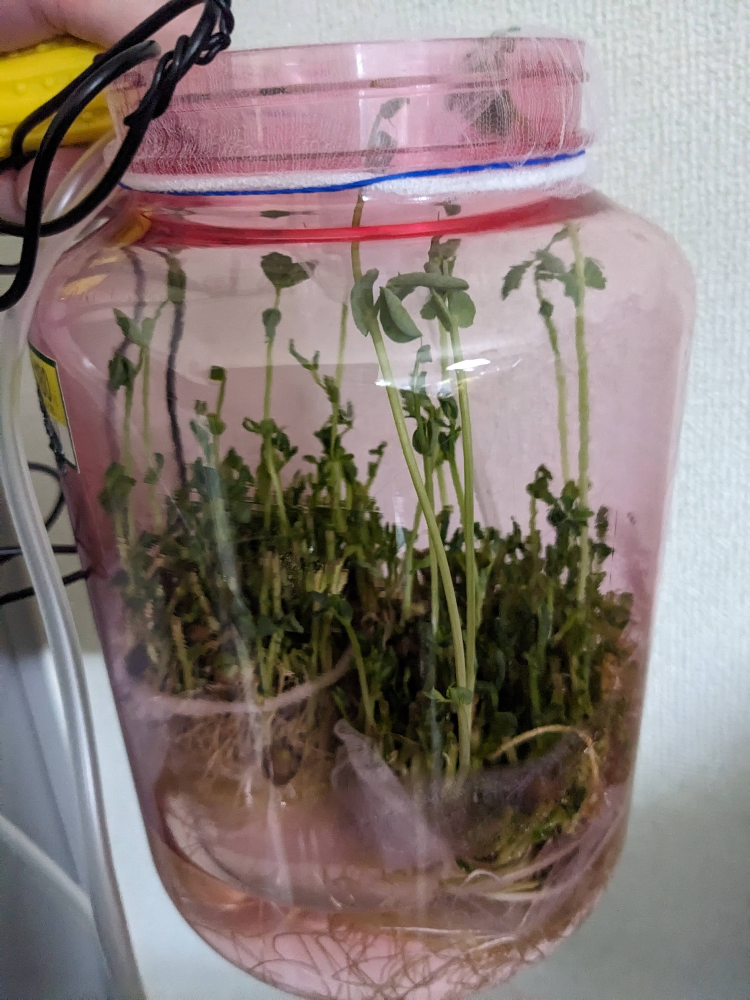
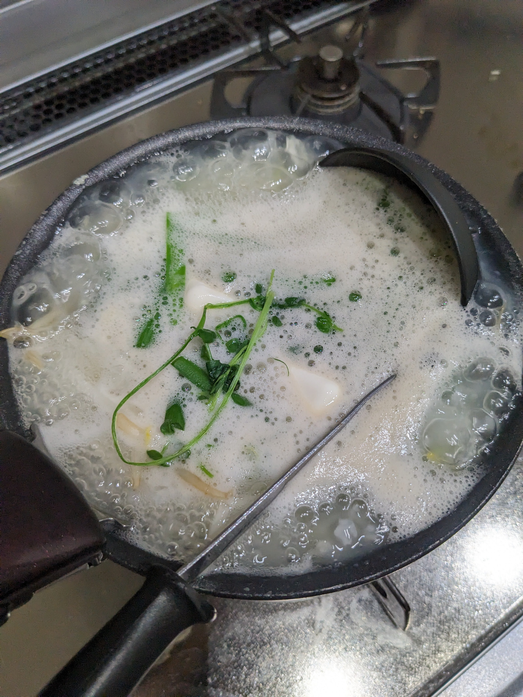
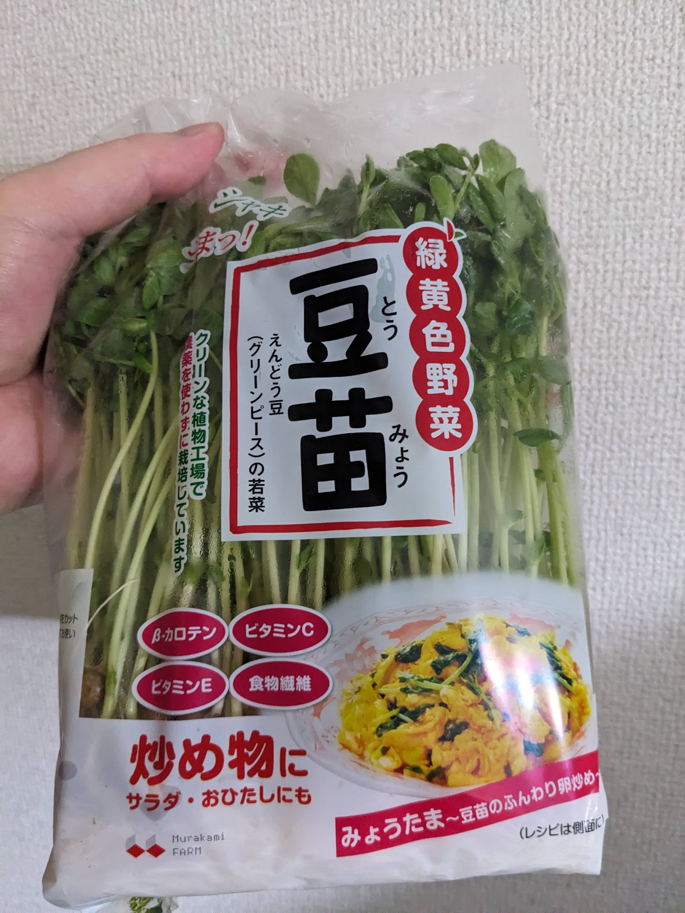
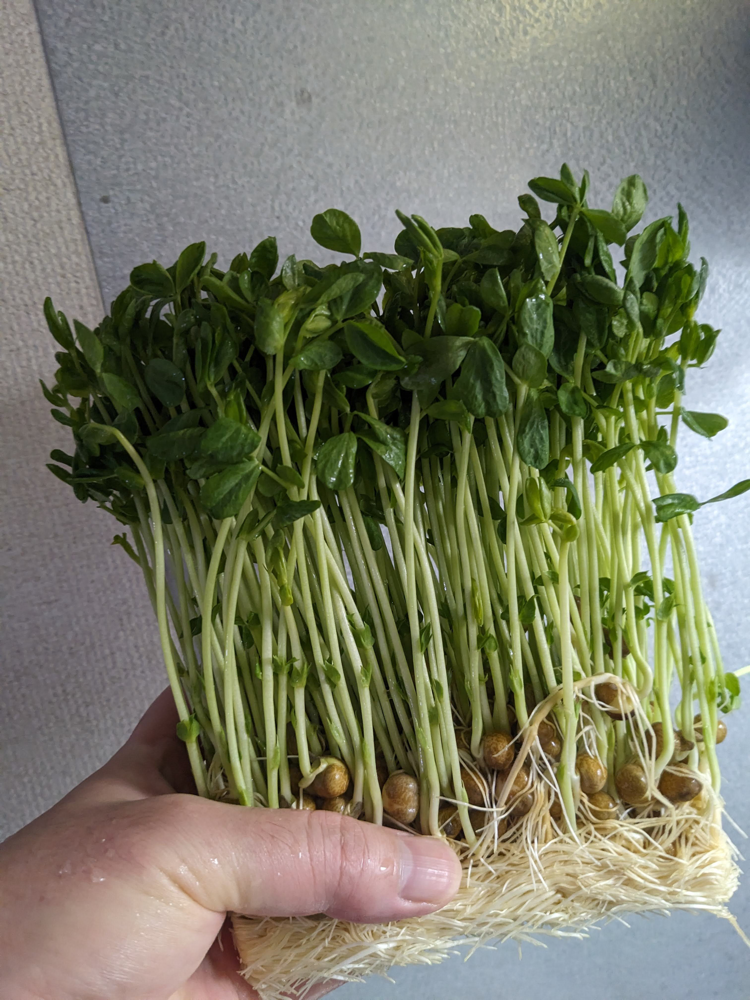
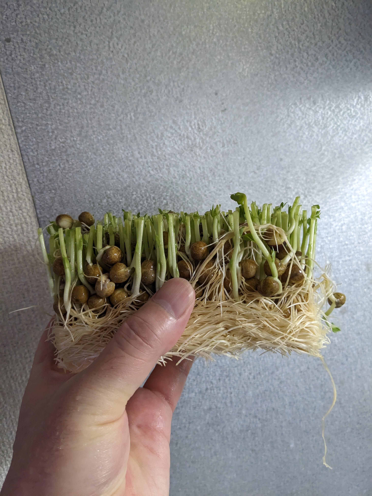
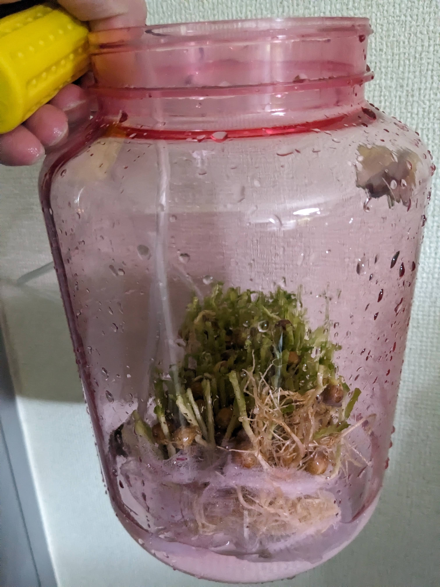
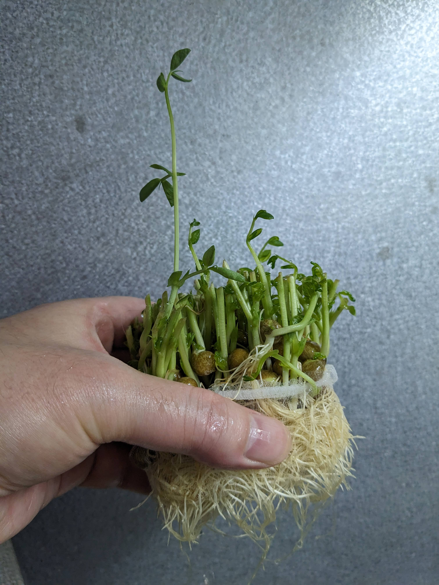
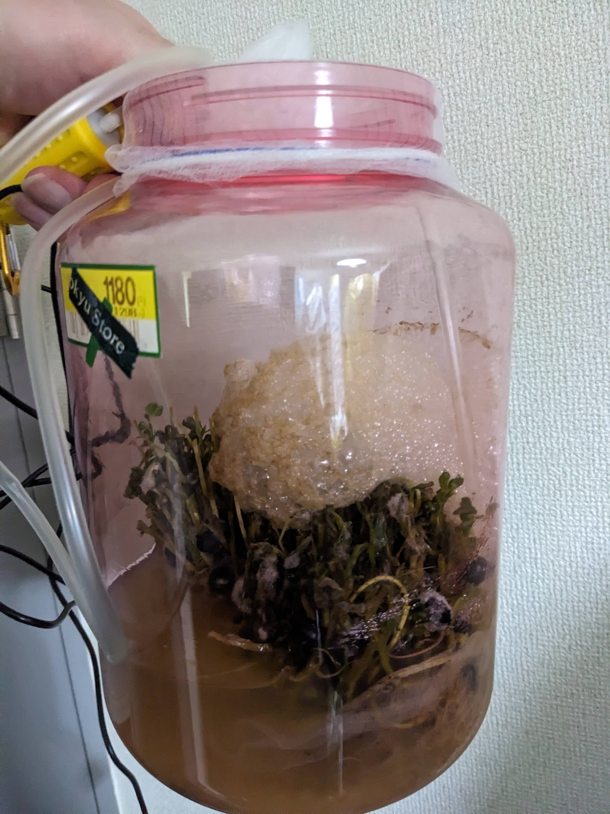
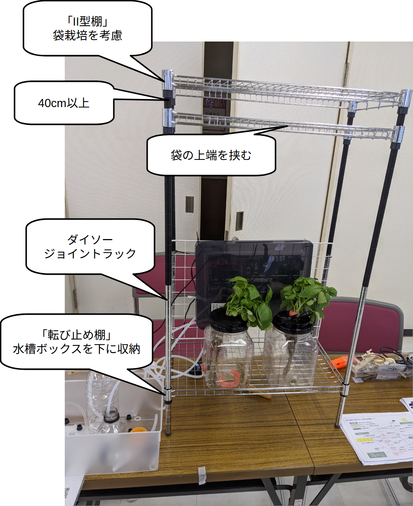

# はじめに

宇宙栽培試行のための閉鎖空間内豆苗栽培と栽培ロボット運用記
(https://github.com/busyoucow/SpaceToumyou)
では、人間の手による管理で豆苗を水耕栽培を行い、

宇宙栽培試行のための栽培ロボット起動及び構造物と配管組み上げ記録
(https://github.com/busyoucow/SpaceRobotFarmTest01)
では、総統より供与された栽培ロボットの組み立て及び動作確認を行った。

  

  

# 前回までのあらすじ
  

  

  

  

  

  

# ハッピーになるための計画
  

# 必要なひみつ道具を組み立てる

# タコじゃないけど配管縦横無尽

# 実際におはな！…じゃなくて豆苗を栽培してみよう

# 

# 

# 時は戻せない。だから腐る前に対策を

# まとめ　～2025年の君たちへ

