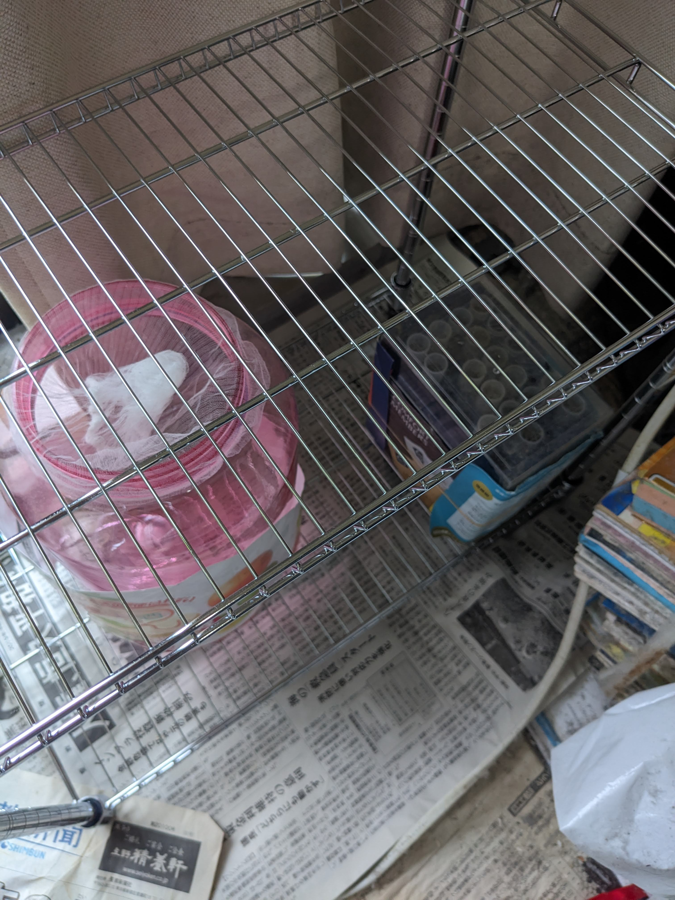
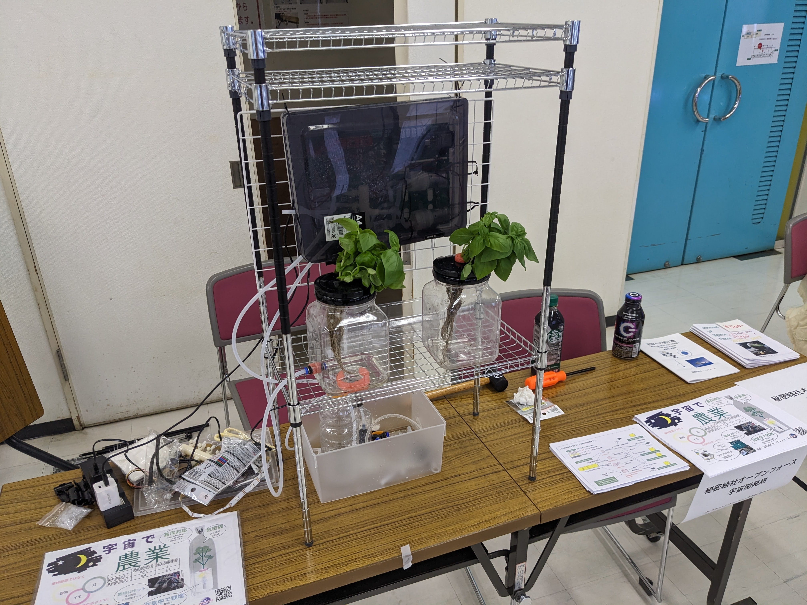
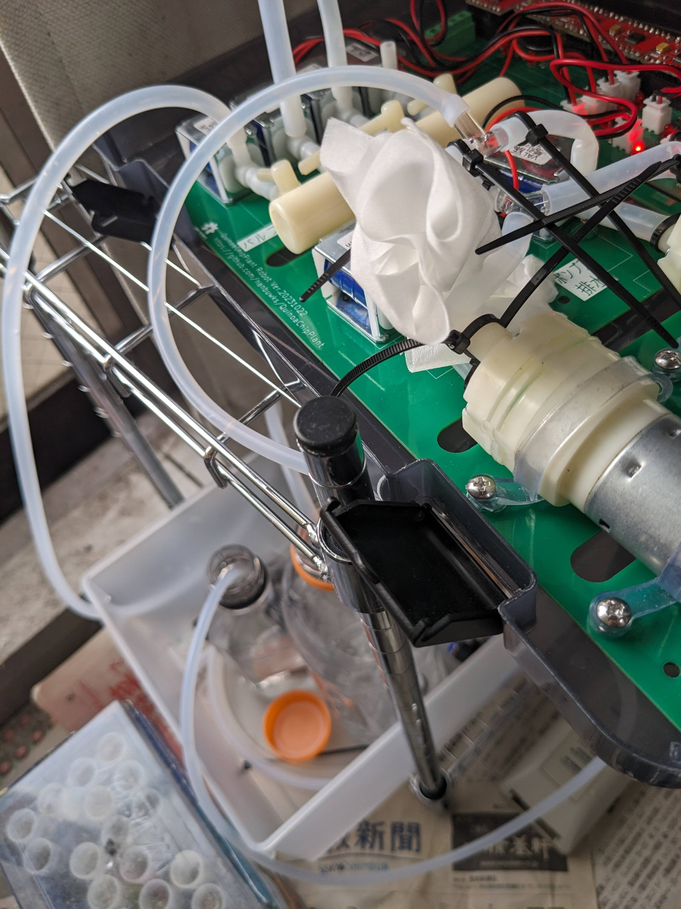
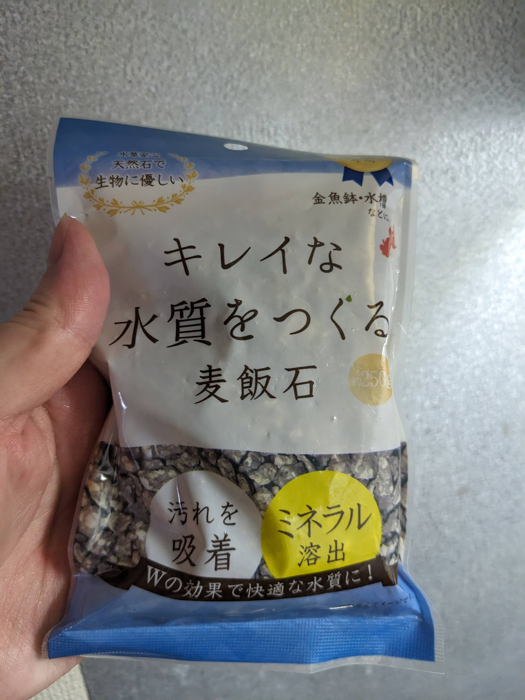
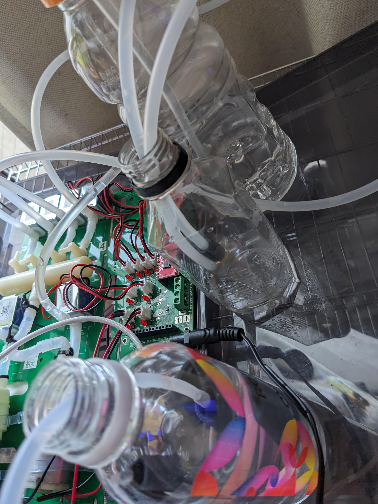
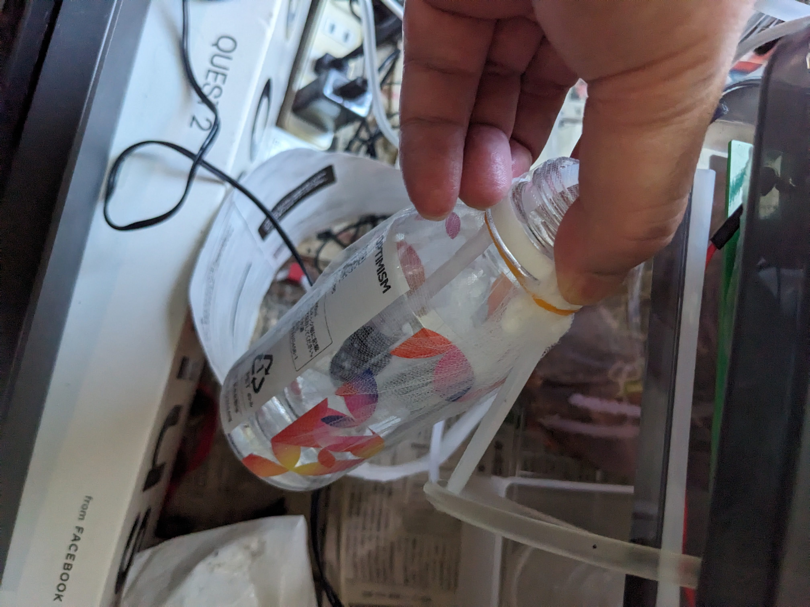
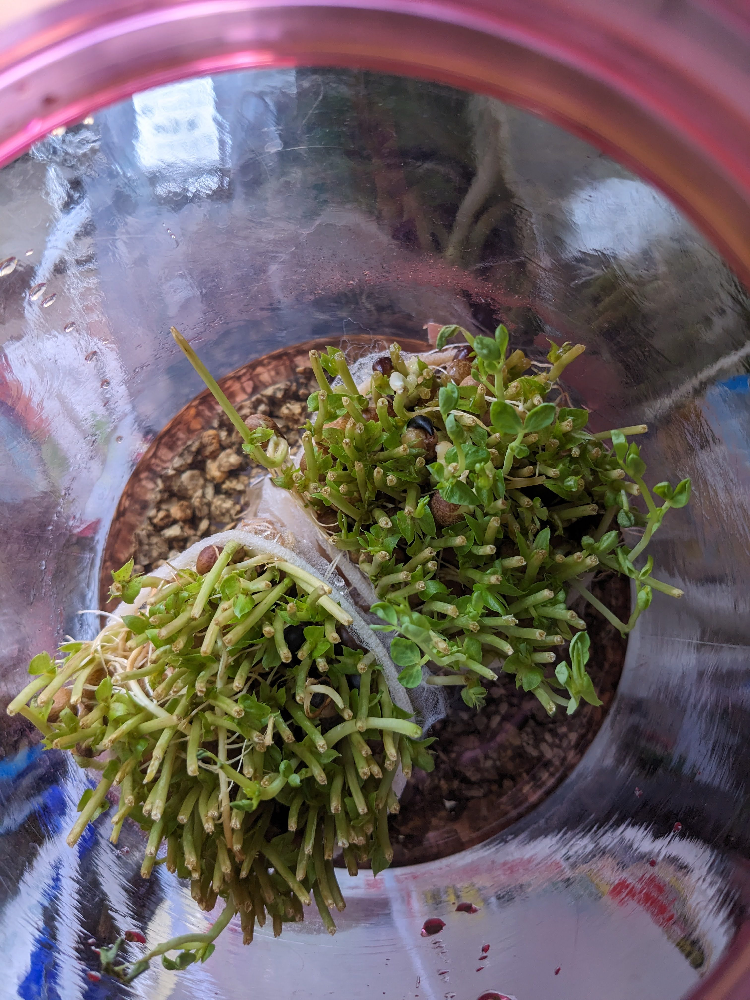
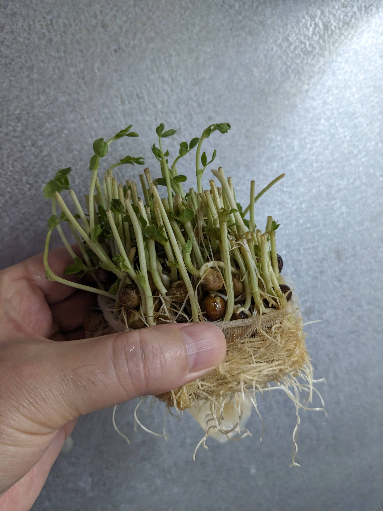

# アブストラクション
秘密結社オープンフォースでの総統(@nanbuwks)指揮による今までの活動として、

宇宙栽培試行のための閉鎖空間内豆苗栽培と栽培ロボット運用記
(https://github.com/busyoucow/SpaceToumyou)
では、人間の手による管理で豆苗を水耕栽培を行い、

宇宙栽培試行のための栽培ロボット起動及び構造物と配管組み上げ記録
(https://github.com/busyoucow/SpaceRobotFarmTest01)
では、総統より供与された栽培ロボットの組み立て及び動作確認を行った。

今回は宇宙市民としての第一歩として、実際に食用植物を総統提供の栽培ロボット
(https://qiita.com/nanbuwks/items/37bffef16036937eecc3) 
を使用して実際に育成しその経過観察を行ったため記載する。

これにより数日間離室した際に栽培中の苗を寿命延命できるか試行し検証していく。
また栽培ロボットを実用に耐えるよう配管の組みなおしを行ったため、その過程も記載する。

# はじめに
H3ロケット打ち上げに関するTV番組が放映され、宇宙関連イベントも行われ宇宙開発機運が高まっている時に、それは来た。

「みんなをひみつ道具でハッピーにするっピ」（意訳）

政治も経済も国際情勢も混迷を極めているこの最中で、それは清々しい一服の清涼剤にも感じた。
今は2025年である。街には大阪万博のキャラクターが溢れ連日猛暑が報道されている。

総統よりひみつ道具（栽培ロボット）をキットで受け取って1年以上。

都心の広場で栽培ロボット基板を実装確認したり（その後熱中症でダウンした）

乾燥大豆から水で戻してレンチン調理したり（乾燥大豆まだ残っている）

年末にロボスタディオン (@robostadion) ではんだ付けの匠の技を目の当たりにしたり（御徒町の海産物は美味しかった）…

本当に色々あった。

Jaxaが月面に向け有人ローバーを打ち上げるまで、あと6年。

我々もそろそろ目に見える成果があってしかるべきだろう。
と、いうよりこのままでは宇宙市民として生きる時代に間に合わない。

能登半島の復興も気になるが、身体も脳も1セットしかない以上リソースは限られている。
よりよき世界線の選択した未来に向けて、今筆をとる…

  

  

  

# 前回のあらすじ

宇宙栽培試行のための閉鎖空間内豆苗栽培と栽培ロボット運用記
(https://github.com/busyoucow/SpaceToumyou)
に記載されているが

豆苗を買ってきて

  

上半分は美味しく頂き

  

残った下半分を使って栽培ロボットを使わず育成

  

発芽試験に使ったプラ果実酒瓶に入れて週2回水替えしエアポンプで空気を水に含ませる

  

すくすくと育った部分を何度か収穫し

  

使用限界を超えた豆苗の根は腐っていった…

  

# ハッピーになるための計画
  

宇宙空間にて長期滞在する場合、打ち上げコストとの兼ね合いにより新鮮な食料の現地生産による確保を検討する必要があると考える。
また昨今災害や気象不順により農作物の生産に不都合が生じ、物流危機とあいまって新鮮な食材の確保が安定してできないという事態が増えつつある。
令和の米騒動はもはやフィクションではなくなった。

 ハッピーになるにはまず食事からと考えるッピ。…もとい、

食事の確保は人間の幸福に関して大きな比重を占めるのは否定できないであろう。

そこで、実践が比較的容易な簡易的植物栽培システムを稼働させ実証実験するものとする。

また、これにより数日間離室した際に栽培中の苗を寿命延命できるか試行し検証するものとする。

上記の写真は以前行われたイベント「オープンハードカンファレンス」にて実稼働ではないが栽培ロボット動作デモを行った際のものである。

詳細は

宇宙栽培試行のための栽培ロボット起動及び構造物と配管組み上げ記録
  (https://github.com/busyoucow/SpaceRobotFarmTest01) 

 に掲載されているため興味があれば参照して欲しい。

# 必要なひみつ道具設置機材を組み立てる
アニメや漫画ではないのですぐ使える状態のセットが販売されているものではない。
しかし、使用する部材の大部分は100円ショップのダイソーで入手できる。
詳細は上記 (https://github.com/busyoucow/SpaceRobotFarmTest01) に記載されているが…

ちゃんと機材リストをここにも記載するっピ。

## 必要な部材リスト

|品目|数量|部位|
|:----|:----|:----|
|ダイソージョイントラック用棚(II型)25cm × 45cm|2枚|ラック上端に2枚使用し細長いビニール袋上部を間に通して固定する(写真では袋は未実装)|
|ダイソージョイントラック用ポール39cm|4本|ラック下部に使用|
|ダイソージョイントラック用延長ポール38cm|4本|ラック上部に使用(黒いポール部分)|
|ダイソージョイントラック用バスケット棚25cm × 45cm × 6.5cm|1枚|ラック最下部に使用し栽培瓶を保持|
|ダイソーフリーマルチネット35cm × 35cm|1枚|背面に固定し栽培ロボットを黒いファイルケースに入れて吊り固定|
|ダイソージョイントラック用固定部品|3パック(12個)|ポールにつけて棚を固定するのに使う|

## 組み立ててみる

  

メタルラックを実際に組み立てるとこのような感じになる。

  

ピンクの栽培瓶を置いてみる。この後下段奥には給水ボトルと排水ボトルが格納されたプラスチックケースを置き、メンテナンスがしやすいよう上段には栽培ロボットを置く予定であった。

## スペースとの兼ね合いにより部材をコンパクトに
しかし、この実験は筆者の狭いワンルームにて行われている都合上部材によって部屋スペースが圧迫されて不都合が生じていた。

そこでもう少しコンパクトな部材を取り寄せて実験途中に間に合ったため、開始4日経過時点で組みなおすこととした。
部材の変更は以下の通りである。

ダイソージョイントラック用棚(II型)25cm × 45cm → ダイソージョイントラック用棚(II型)29cm × 29cm

# そして、ひみつ道具登場

そしてこれが総統より供与されたひみつ道具。栽培ロボットである。

栽培ロボットをインストール 1st
(https://qiita.com/nanbuwks/items/37bffef16036937eecc3) 

  

只の電子基板じゃないかとがっかりされたかもしれないが、アームも搬送ユニットも無くても立派にロボット(自動機械)である。
様々な機能があるが、今回は搭載されたウォーターポンプ2基とWi-Fiに接続可能なマイコン、多数のバルブを使用して栽培運用するものとする。

必要な能力は
- 給水ボトルから一定条件を満たしたときに栽培瓶へ給水動作できること
- 栽培瓶から一定条件を満たしたときに排水ボトルへ排水動作できること
- 毎日指定された時刻に一定条件を満たしたものと判断できること
- ボタンを押したとき一定条件を満たしたものとして試験動作できること

この栽培ロボットはこれら全ての条件を満たしている。

指定された時刻に一定条件を満たしたものと判断するため、設置場所である自宅のWi-Fiルータと無線(Wi-fi)接続し、インターネット経由で外部のNTPサーバより現在時刻を取得して指定時刻であるかどうかを判断するようなプログラムをマイコン(ESP32)へ書き込んだ。

このあたりの詳細はまた別の機会にて紹介するものとする。

## ひみつ道具関連の必要な部材
栽培ロボット以外は100円ショップやホームセンターにて調達できる。

|品目|数量|部位|
|:----|:----|:----|
|栽培ロボット|一式|ダイソーフリーマルチネットにファイルケースを挟んで固定する(今回の試験ではメンテナンスの都合上未固定)|
|太いチューブ|4本|モータポンプと接続する バルブ等へは細いチューブを継いで使用する|
|細いチューブ|11本|バルブと分岐バルブ及び分岐パイプに接続する ボトルに直接入れるのにも使用|
|インシュロック|1袋|チューブを接続する各所に使用し水漏れを防ぐ|
|シールテープ|1巻|水漏れが酷いときに適宜使用|
|給水ボトル|1本|液肥を1～2滴添加した水道水を入れて使う|
|排水ボトル|1本|排水が入るため給水ボトルより大きめが望ましい|
|栽培瓶|1本|栽培したい植物の苗を入れて使うため口が大きいもの|
|プラスチックケース|1箱|給水ボトルと排水ボトルを入れてラック棚に設置|
|麦飯石|1袋|水の汚れを抑制する|
|排水口ネット|1袋|ボトルや瓶の口を覆う防虫ネットや苗を分けるのに使用|
|輪ゴム|1袋|防虫ネットを固定する際に使用|
|エアーポンプ|1式|栽培ロボットとは別に魚飼育用のものを常時稼働し空気の循環も図る|

また、今回は異物混入防止のため、給水側にチューブ用ウォーターストーンと緩めた噴霧用ノズルを付けているが必須ではない。

# タコじゃないけど配管縦横無尽
配管は以前の記事()で接続して栽培ロボット動作展示で稼働させたが、配管からは水漏れを生じている状態であった。

  

そのため栽培ロボットはメタルラックにワイヤネットを垂直に取り付けそこに栽培ロボットを固定し、漏れた水が基板の電装部分に行かず下へ落ちるようにした。
その下の段には水受けとしてACタップのプラスチック包装を置き、更に下にプラスチックケースを配置し給水ボトルと排水ボトルを格納した。
これで会場の床は水浸しになることは無くなった。
しかしこれは応急的な措置であり、実際に栽培時運用検証を行う際は改善する必要があった。

そこでまずは栽培ロボットそのものの配管水漏れを防ぐことにした。

  

まずは水を通すチューブとポンプやバルブとのつなぎ目に黒いインシュロック(結束バンド)をつけて水漏れを抑えてみた。

  

しかし、水漏れを完全に防ぐことはできなかった。ティッシュを置いているところで水漏れを起こしている。
何度か検証した結果、水漏れを起こしやすいのはウォーターポンプ(配線の付いたベージュの円筒形のもの)とチューブとの接続部、そして三又部品との接続部であった。

  

そこでウォーターポンプに接続した太めのチューブに細いチューブを差し込みより接続部に合ったチューブと接続することによりゆるみを防ぐこととした。

  

これにより、水漏れは劇的に減った。

# 実際におはな！…じゃなくて豆苗を栽培してみよう
ドクダミの花ではなく美味しく食べられる豆苗を栽培ロボット管理のもと栽培していく。

  

前回同様、豆苗を買ってくる。最近は値上げこそしないが閉店間際には売り切れることも少なくない。

  

元気に生えている苗を

  

根の部分から二つに分ける

  

上部を切り取り

  

排水口ネットをつけて小分けにする

  

今回はメンバー間フィードバックにより知った麦飯石を敷いてみる

  

これで水質が改善されるとよいのだが

  

苗を一つ置くがスペースはまだあるので

  

切り分けたもう一つも排水口ネットをかけて

  

水と共に瓶の中に入れると瓶はいっぱいになる

  

瓶の口にも排水口ネットをつけて輪ゴムで留め防虫対策とする

  

今回もエアーポンプで常時空気を水に含ませる

  

エアーポンプは今夜から常時稼働させておく

  

今回切除した茎と葉は調理して頂くとしよう

# ひみつ道具の導入
そしてこの後、家を４日空ける必要に迫られた。

今こそひみつ道具…もとい栽培ロボットを実際の栽培で稼働する好機である。
記憶が世界線の海に没する前に、設置する過程をここに記すものとする。

  

まずは栽培ロボットを用意する。

  

配管構成を一部変更して、栽培瓶の他に給水瓶と排水瓶を用意する。

  

給水側パイプにはゴミが入らないようストーンをつける。

  

上から排水瓶、栽培瓶相当のテスト用仮の栽培瓶、給水瓶。給水瓶が楽天のペットボトルなのはご愛敬。

  

ボタンを押して実際に稼働するかテスト。

  

事前にプログラムを変更し、午前６時半になるかボタンが押されたらまず栽培瓶から排水を8秒間行う。

その後栽培瓶へ8秒間給水を行う。最後に60秒待ち6時半に稼働した際に連続して動作するのを防ぐ。

  

とりあえずうまく動作しているようだ。

  

初めは空気が送られていたが、何度かボタンを押したので排水瓶へは水が流れている

  

仮の栽培瓶へも水が溜まっている。

  

給水瓶も順調に水が減っている。

  

試験稼働は成功と言っていいだろう。

  

栽培ロボット側も特に水漏れをしていない。

  

では、ここから実際の栽培瓶に移行するものとする。

  

実際の栽培には液体肥料を添加する。

  

添加量は一回に1～2滴ほど。これを水道水で薄める。

  

給水瓶と排水瓶は引き続き同じものを使用。排水瓶は万が一の水溢れを考え大きくしてあり、更に万が一の水漏れを考え二つの瓶はプラスチックケースに入れる。

  

給水瓶と排水瓶には排水口ネットを取り付け、虫の侵入を防ぐ。

  

栽培瓶にも深めの排水口ネットを取り付けて、虫の侵入を防ぐ。

  

栽培瓶には給水パイプと排水パイプ、エアーポンプ用のパイプ（栽培ロボットとは別実装）の三本のパイプが入る。

  

給水パイプには異物の逆流を防ぐためミストノズルを緩めた状態でつけてある。

  

給水瓶と排水瓶も稼働実験位置に配置

  

栽培ロボットに接続し、仮ではあるが蓋をする。ケース穴あけ等は今後行うものとする。

  

一回動かしてみるが、ちゃんと給水は出来ているようだ…が？

  

排水が空気ばかりで水が流れてこない。

  

どうやらパイプの癖で排水管が水のある底についていないようだ。

  

修正し排水するかテスト。

  

うまく排水ボトルに水が吐き出された。

  

ここまでで動作に支障はない。あとは明日の6時半に稼働することを願うばかり。

  

水漏れも起きていないようだ。

# 豆苗の運命
液肥を付加しているとはいえ豆苗の根が持つ生命力と豆部分の栄養素に頼っているため、いつかは再生できずに腐ってしまう。

今回はどうなっただろうか。

  

家を空ける日数が5日に伸びてしまったが、栽培ロボットは順調に動いているようだ。

  

防虫ネットから虫が侵入している形跡はない

  

チューブが抜けたりもしていないようだ

  

中の苗もまだ生きている

  

給水ボトルは中身がずいぶん減ったが少し残っている

  

排水ボトルは少し変色した水が溜まっている

  

栽培瓶の排水チューブも無事底のほうについている

  

給水もできているようだ

  

栽培ロボットのボタンを押して給排水動作を確認すると無事に水が流れる

  

このタイミングでメタルラックを45x25サイズのものから29x29サイズのものへ変更する。
45x25サイズのものはイベント展示用に再利用する事とする。

  

メタルラックを交換して翌朝。栽培ロボットも翌朝6時半にはちゃんと稼働していた。

  

## 水交換してあと3日もたせる
このタイミングにて栽培瓶を含めた水を全交換する。

  

メタルラック交換時に排水瓶の水をこぼしてしまったため少なくなっているが、ここからポンプとチューブ内の水抜きのために栽培ロボットのボタンを押して何度か稼働させる事とする。

  

左から栽培瓶側排水チューブ、栽培瓶側給水チューブ（緩めたミストノズル付き）、排水瓶側排水チューブ、給水瓶側給水チューブ（ストーンつき）

この状態から空気が出てくるまで何回か栽培ロボットのボタンを押して稼働させ水をプラスチックケース内へ排出する。

  

切り口が変色しているがまだ頑張っている

  

枝分かれした成長点からは新しい芽が出ている

  

茎の変色が気になる

  

根は順調にネットを抜けて生えてきているようだ

  

まだ青い部分もあるため今後に期待

  

もう一つの苗も同じように見えるが芽は多いと感じる

  

こころなしか元気そうに見える

  

麦飯石をこぼさずに栽培瓶を水洗い

  

少し水道水を入れて

  

水で流した苗を入れていく

  

今後は元気に育ってほしい

  

ラックに設置し

  

チューブを3本挿入

  

まとめて防虫ネットで覆う

  

給水ボトルと排水ボトルも配置し

  

栽培ロボットの動作チェック

  

給排水チューブから空気が出た後無事に水が出てきた

  

ここからまた3日間家を空けるため、その間も安定稼働することを祈ろう。

# 栽培ロボット未使用時とどう変わったか
前回の栽培ロボット未使用にて豆苗を栽培した際は、4～5月だったため室温が25度程度とそれほど上がっていなかった。

しかし今回は時期を見たとはいえ8月末から9月にかけて栽培を行ったため、猛暑により離室時の室温が30度を超えたのは事実である。

そのためか切り口の変色が速くなった可能性がある。

  

こちらは前回栽培した時に7日経過したもの。株切り口の変色は始まっているもののまだ青さを残している。

  

こちらは前出した今回栽培した5日＋1日で6日経過したもの。株切り口が明らかに茶色く染まっている。成長も遅いようだ。

このことにより、栽培ロボットを入れ水環境は改善したにもかかわらず室温上昇により豆苗の苗が弱っていると考えられる。

# 時は戻せない。だから腐る前に対策を

今回は栽培ロボットを使用して長期の離室に耐えられるか検証してみた。
しかし水環境よりも高温障害のほうが影響が大きいのではないかという所感を得た。

今後は室温が同程度の環境になるまで豆苗の苗を何度か使用し影響を検証していこうと考える。

# まとめ　～2025年の君たちへ
いつか、「あの頃は～」みたいに語られる日が来るかもしれない。
その時に失敗を重ねて世界の動乱に巻き込まれているか、
失敗から学び一つ抜けられるか。

世界線は常に移動している。

高温障害に関してはまさに農業全体で直面している問題であり、高温に耐えられる品種が出回るまでは各自空調の稼働により対処していくしかないのが残念ではある。
もし解決できる方法が見つかればまた筆をとろうと思う。

今回、豆苗を入手する際帰宅が深夜になり店舗にて売り切れになってしまったケースが発生した。
今後も作物の生育や物流の問題によりこのようなケースが増えると予想される。
もし、このことが我々の食生活を深刻に脅かすことになっても何とか生きられるように。
検証を続けていこうと思う。

願わくばこれが、滅びた民族の遺稿とならないことを…

# 引用資料

タコピーの原罪　https://www.tbs.co.jp/anime/takopi_project/

busyoucow,「宇宙栽培試行のための発芽試験記録」Journal of SpaceFarm Vol.2 2025-1, 秘密結社オープンフォース, 2025

https://github.com/busyoucow/SpaceToumyou/

busyoucow,「宇宙栽培試行のための栽培ロボット起動及び構造物と配管組み上げ記録」
  (https://github.com/busyoucow/SpaceRobotFarmTest01) 

nanbuwks, 「栽培ロボットをインストール 1st」
https://qiita.com/nanbuwks/items/37bffef16036937eecc3 

